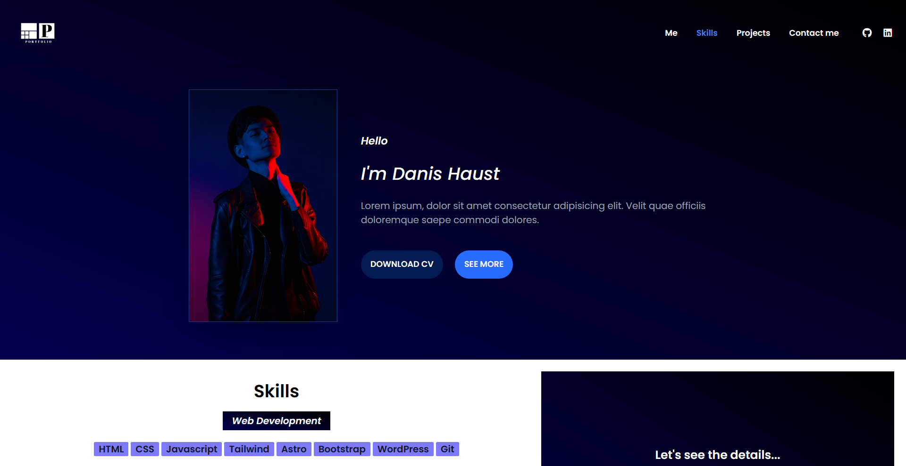

# Proyect Landing - Portfolio

A clean, simple and nice portfolio. Giving its use mainly to share personal projects and give details about what you most want to show, although I won't use it but will keep it as a project.


## 🚀 About Me
I am an aspiring designer and Front-End developer, I place myself more in this center because I like to make structure in web pages, give styles and interactivity, I keep improving in my free time giving the best of me.
## Installation

This way you will be able to work on this project after downloading it:

```bash
  npm i
  npm run dev

  //If you wish you can distribute this project to production with:
  
  npm run build
  npm run preview
```
    
## Screenshots




## Appendix

This project was done as practice with Adobe XD, Tailwind, Astro and JS, I definitely liked that I can finish a project and leave out the frustration I do when doing projects, as I used to delete every project because of it.
## Demo

https://landing-elegantport.netlify.app/


## Authors

- [@pierobryanbl](https://www.linkedin.com/in/piero-bryan-benigno-leyva-604775244/)

